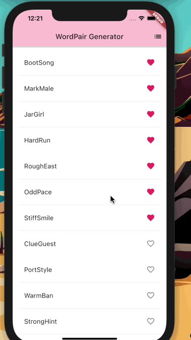

# About the Author

Name: Samira Mc Queen
[LinkedIn](https://www.linkedin.com/in/samira-mc-queen-1882431a7/)

Free Spririted Caribbean Woman.
Software Developer and aspiring Game Developer

# Project

## Experience with Project

- This was my first time using Flutter 
- The eperience was great and i enjoyed it, and i will continue to do more Flutter projects

# Application Features

- The word generator generates words as pairs. 
- User can favorite a word pair 
- User can view their favorite word pairs

# Frontend Built With

- Flutter

# Project Setup

Once the project is downloaded locally on your device do the following:
`
npm install
`

If there are dependencies that need updating or you want to check:
`
npm outdated
`

If there are outdated dependencies:
`
npm update
`

To check and update packages in package.json:
`
npx npm-check-updates -u
`
# Build Setup

A few resources to get you started if this is your first Flutter project:

- [Lab: Write your first Flutter app](https://flutter.dev/docs/get-started/codelab)
- [Cookbook: Useful Flutter samples](https://flutter.dev/docs/cookbook)

For help getting started with Flutter, view our
[online documentation](https://flutter.dev/docs), which offers tutorials,
samples, guidance on mobile development, and a full API reference.
